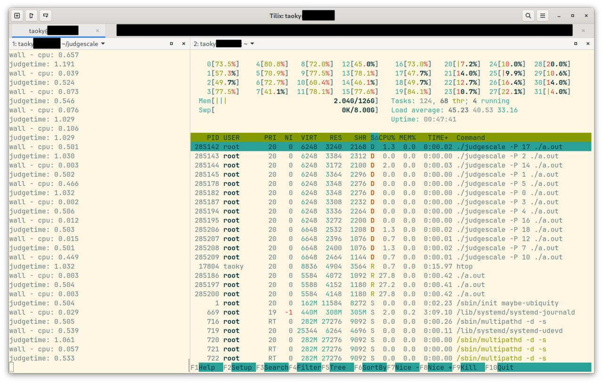

# Judgescale

A test necessary for large contests which uses a single server, multiple instances pattern of judgehost deployment.

Modified from domjudge/judge.

## How to test?

0. Reboot to get a clean kernel state.
1. Run createcgroups.sh to create domjudge cgroups.
2. `make`
3. Adjust `TASKS` in run.py.
4. `python run.py`, wait and see load, process states and judgescale output. Please be patient, and if possible run it at least for 1 hour.
5. After test you could run `clean.sh` to clean created domjudge subcgroups (domjudge cgroup itself will NOT be removed).

### Results

If you see `load` >= 2 * `TASKS`, you are doomed.

Example 1:

(32 cores KVM, 20 tasks, ~45min, Linux 5.15, load >= 40)

**It's strongly recommended to use Linux 6.3+ as your judgehost kernel.** Otherwise, you are probably doomed.
